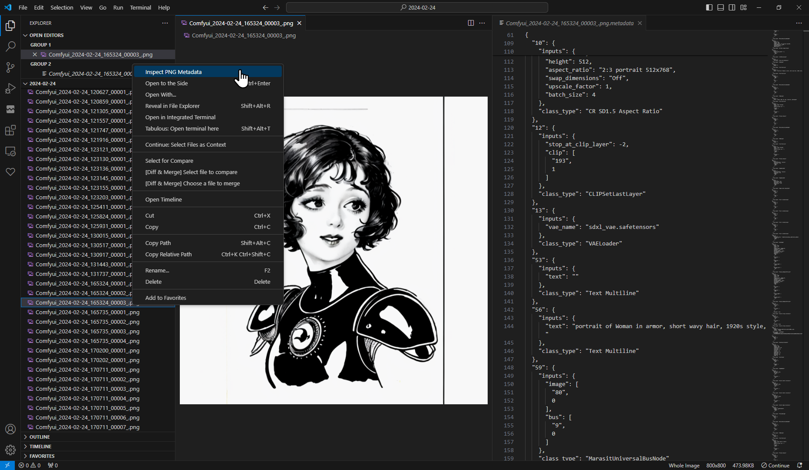

# Image Metadata Display Extension for VSCode

This extension for Visual Studio Code allows users to view metadata of PNG images directly within the editor. With a simple command, you can inspect the embedded metadata of any JPG, PNG or WEBP file in your workspace (& beyond via command palette). It was originally created for easily inspecting [ComfyUI](https://github.com/comfyanonymous/ComfyUI) images' metadata from within VSCode. Special thanks to ChatGPT for all the assistance.

## Features

- **Inspect JPG, PNG & WEPB Metadata** - Opens a read-only document next to the image that displays the PNG file in question's metadata.

## Usage

To view the metadata of a PNG file, you have several options: 

1. Right-click on a PNG file within the Explorer pane.
2. Right-click on the title bar of an open PNG preview.
3. Use the "Inspect PNG Metadata" command from the extension, which you can find in the Command Palette. This will open a dialogue box to select the image you'd like to inspect.

## Installation

To install the extension, follow these steps:

1. Download a/the [`.vsix.zip` file](https://github.com/Gerkinfeltser/image-metadata-display/releases) for the Image Metadata Display extension & unzip somewhere.
2. Open Visual Studio Code.
3. Go to the Extensions view by clicking on the Extensions icon in the Activity Bar on the side of the window or by pressing `Ctrl+Shift+X`.
4. Click on `...` at the top of the Extensions view, and select "Install from VSIX...".
5. Locate the `.vsix` file you downloaded and select it.

The extension will be installed and ready for use.

## Requirements

- Visual Studio Code version 1.87.2 or higher.

## Extension Settings

This extension contributes the following command:
- `extension.inspectImageMetadata`: Inspect Image Metadata

## Known Issues/Future Work

- To retain a metadata document from being overtaken by another, pin the doc via the titlebar right-click "Pin" menu entry.
- Extracting the workflow json portion to its own json file does not seem to create a working workflow in Comfyui. Maybe *someday*...
- Figure out a way to make this extensions smaller. It seems crazy that this extension is 10 megabytes, am-I-right?

## Release Notes

### 0.0.4
Added support for JPG & WEBP files.

### 0.0.3
Initial release of Image Metadata Display.
