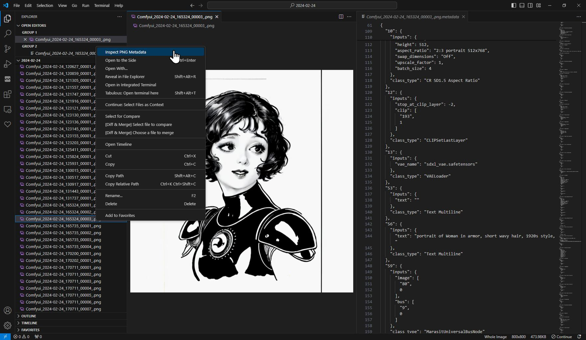

# Image Metadata Inspector for VS Code

This extension for Visual Studio Code allows users to view metadata of PNG, JPG, JPEG, and WebP images directly within the editor. With a simple command, you can inspect the embedded metadata of any image file in your workspace (and beyond via command palette). It was originally created for easily inspecting [ComfyUI](https://github.com/comfyanonymous/ComfyUI) images' metadata from within VS Code.



## Features

- **Cross-Platform Support** - Works on Windows, macOS, and Linux with automatic ExifTool detection
- **Multiple Image Formats** - Supports JPG, JPEG, PNG, and WebP images
- **ComfyUI Workflow Support** - Perfect for inspecting ComfyUI generated images and their embedded workflows
- **Prettified JSON Metadata** - JSON strings in metadata are displayed in a prettified format for better readability
- **Smart Error Handling** - Clear error messages and fallback mechanisms for different platforms
- **Comprehensive Logging** - Debug and informational messages logged to VS Code Output console

## Installation

### From VS Code Marketplace (Recommended)
1. Open VS Code
2. Go to Extensions (Ctrl+Shift+X)
3. Search for "Image Metadata Inspector"
4. Click Install

### From VSIX File
1. Download the `.vsix` file from the latest [release](https://github.com/Gerkinfeltser/image-metadata-display/releases)
2. In VS Code, go to **Extensions** > **...** > **Install from VSIX...**
3. Select the downloaded file

## Usage

### Multiple Ways to Inspect Metadata:

1. **Right-click on an image file in Explorer**:
   - Right-click on any supported image file and select "Inspect Image Metadata"

2. **Right-click on an open image tab**:
   - Right-click on the title bar of an open image preview and select "Inspect Image Metadata"

3. **Command Palette**:
   - Press `Ctrl+Shift+P` (or `Cmd+Shift+P` on macOS)
   - Type "Inspect Image Metadata" and select it
   - Choose an image file from the dialog

## Cross-Platform Support

- **Windows**: ✅ Fully supported with bundled ExifTool executable
- **macOS**: ⚠️ Improved support with native ExifTool fallback (install with: `brew install exiftool`)
- **Linux**: ⚠️ Improved support with native ExifTool fallback (install via package manager)

The extension automatically detects your platform and uses the best available method. **Note**: macOS and Linux support has been significantly improved but needs community testing. Please report any issues via GitHub Issues.

## Viewing Output Logs

To view detailed logs and troubleshoot issues:

1. Open the Output panel: `View` > `Output` or `Ctrl+Shift+U`
2. Select "Image Metadata Extension" from the dropdown
3. View initialization and operation logs

## System Requirements

- Visual Studio Code version 1.87.0 or higher
- For macOS/Linux: ExifTool installed system-wide (optional, but recommended)

## Supported File Types

- `.jpg` - JPEG images
- `.jpeg` - JPEG images  
- `.png` - PNG images
- `.webp` - WebP images

## Perfect for ComfyUI Users

This extension was originally designed for ComfyUI users who want to:
- Inspect workflow metadata embedded in generated images
- View generation parameters and settings
- Debug workflow configurations
- Extract prompt information from images

## Known Issues

- Workflow JSON extraction to separate files doesn't create working ComfyUI workflows (planned feature)
- Some ExifTool features may require native installation on macOS/Linux

## Contributing

Contributions are welcome! Please see our [GitHub repository](https://github.com/Gerkinfeltser/image-metadata-display) for:

1. **Reporting Issues**: Use GitHub Issues for bug reports and feature requests
2. **Contributing Code**: Fork, create a feature branch, and submit a pull request
3. **Documentation**: Help improve documentation and examples

### Development Setup

```bash
git clone https://github.com/Gerkinfeltser/image-metadata-display.git
cd image-metadata-display
npm install
npm run compile
```

Then press F5 in VS Code to test the extension.

## Acknowledgments

- [ExifTool](https://exiftool.org/) - The powerful metadata extraction tool
- [exiftool-vendored](https://www.npmjs.com/package/exiftool-vendored) - Node.js wrapper for ExifTool
- [VS Code Extension API](https://code.visualstudio.com/api) - Microsoft's extension framework
- [ComfyUI](https://github.com/comfyanonymous/ComfyUI) - The amazing node-based AI image generator

## License

This project is licensed under the MIT License - see the [LICENSE.txt](LICENSE.txt) file for details.

## Changelog

For detailed release notes, please see the [CHANGELOG.md](CHANGELOG.md) file.